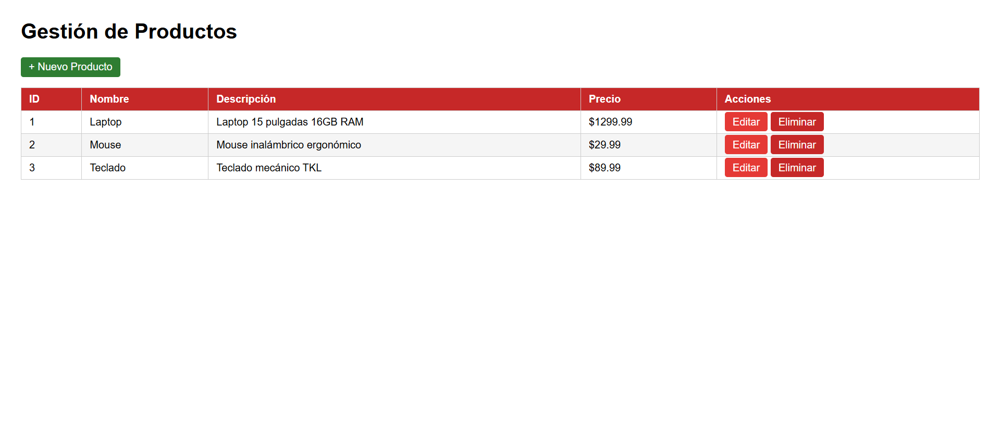
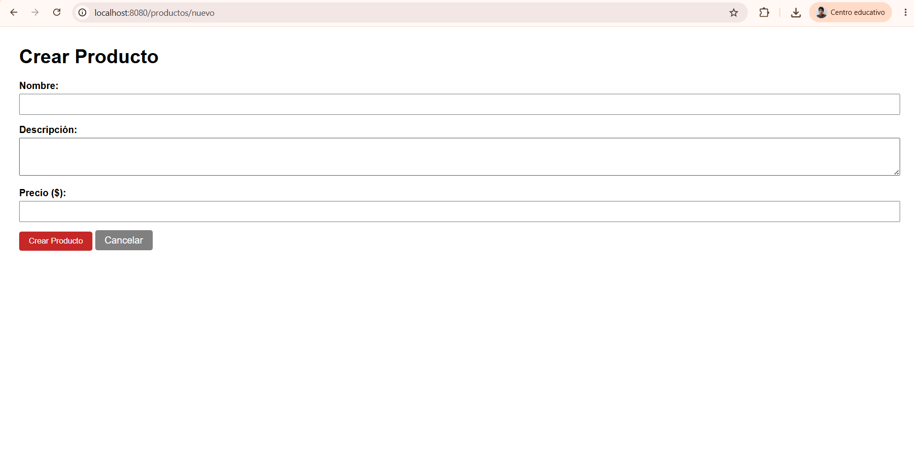
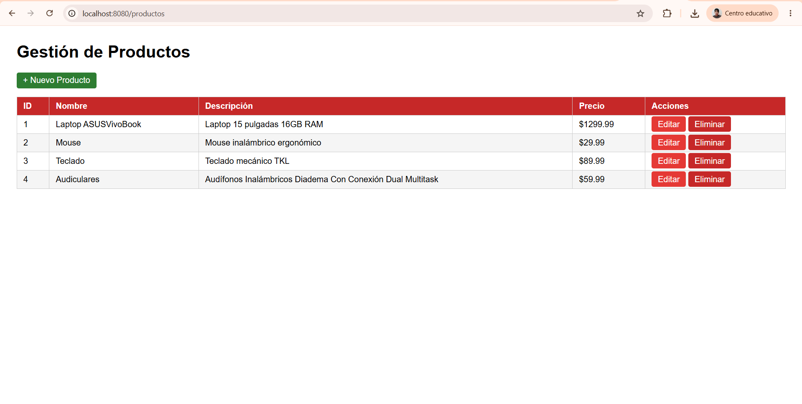
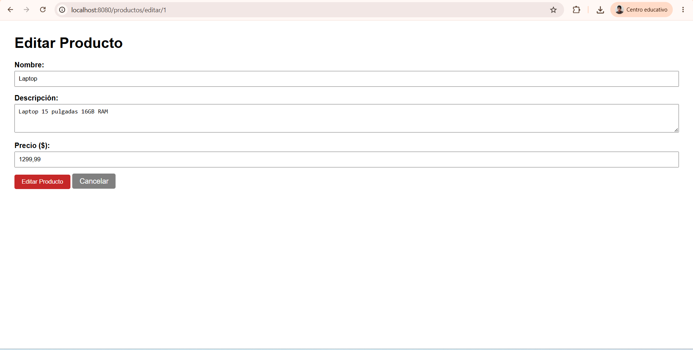

# Laboratorio Unidad 7 - Spring Boot Básico

## Gestión de Productos con Spring Boot y Thymeleaf

Este proyecto corresponde al laboratorio de Programación Web de la Unidad 7. La aplicación permite realizar una gestión básica de productos mediante operaciones CRUD: crear, listar, editar y eliminar productos.

El proyecto fue desarrollado utilizando Spring Boot, el patrón MVC, Thymeleaf como motor de plantillas y una estructura de almacenamiento temporal en memoria.

---

## Tecnologías utilizadas

- Java 17
- Spring Boot
- Spring Web
- Thymeleaf
- Maven
- Spring Boot DevTools
- HTML
- CSS

---

## Funcionalidades del proyecto

La aplicación permite:

- Visualizar una lista de productos registrados.
- Crear un nuevo producto mediante un formulario.
- Editar la información de un producto existente.
- Eliminar productos de la lista.
- Redireccionar después de guardar o eliminar, aplicando el patrón Post/Redirect/Get.
- Mantener los productos en memoria mientras la aplicación se encuentra en ejecución.


---

## Descripción de los componentes

### ProductosWebApplication.java

Es la clase principal del proyecto. Desde este archivo se inicia la aplicación Spring Boot.

### Producto.java

Representa el modelo de datos de la aplicación. Contiene los atributos principales de un producto:

- id
- nombre
- descripción
- precio

También contiene los constructores, métodos get y set necesarios para trabajar con los datos desde el controlador y las vistas.

### ProductoService.java

Funciona como una capa de servicio y repositorio temporal. En esta clase se almacena la información de los productos usando una estructura en memoria.

Este componente contiene los métodos necesarios para:

- Obtener todos los productos.
- Buscar un producto por su ID.
- Guardar un producto nuevo.
- Actualizar un producto existente.
- Eliminar un producto.


## Instrucciones de ejecución

Para ejecutar el proyecto, primero se debe tener instalado Java 17 o superior y Maven.

Luego se abre una terminal en la carpeta principal del proyecto:

```bash
cd productos-web
```

Después se ejecuta el siguiente comando:

```bash
mvn spring-boot:run
```

Cuando la aplicación inicie correctamente, en la consola debe aparecer un mensaje similar a:

```text
Started ProductosWebApplication
```

Luego se abre el navegador y se ingresa a la siguiente dirección:

```text
http://localhost:8080/productos
```

---

## Pruebas realizadas

Se realizaron las siguientes pruebas de funcionamiento:

1. Se inició correctamente la aplicación desde Maven.
2. Se accedió a la ruta `/productos`.
3. Se visualizaron los productos iniciales cargados en memoria.
4. Se creó un nuevo producto desde el formulario.
5. Se editó un producto existente.
6. Se eliminó un producto de la lista.
7. Se verificó que la aplicación redirecciona correctamente después de guardar o eliminar.

---

## Capturas de pantalla

A continuación se agregan las capturas de pantalla del funcionamiento de la aplicación.

### Lista de productos



### Formulario de creación



### Producto creado



### Formulario de edición



---


## Autor

Nombre: Juan David Pulido  
Programa: Ingeniería de Sistemas  
Asignatura: Programación Web  
Unidad: Unidad 7 - Spring Boot Básico